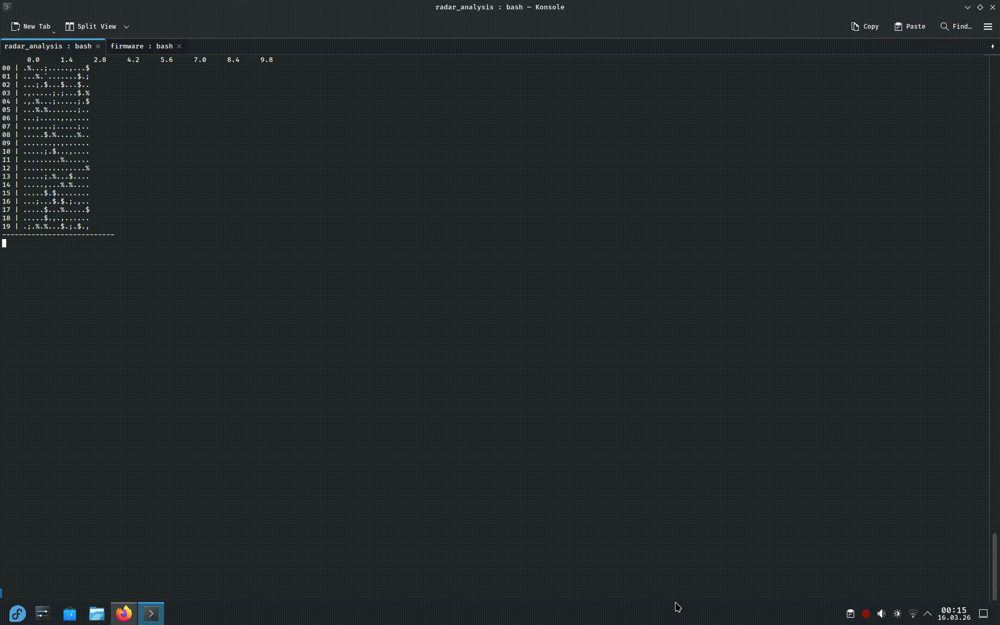

This small project is geared towards impact of DSP and the maximum resolution we can obtain using only cheap an easily available tools.
A data driven approach towards conserving resources and taking customer grade tools to the limit.

## Luckfox Setup

[Luckfox Pico RV1103](https://www.amazon.de/Waveshare-Entwicklungsboard-Prozessoren-Unterst%C3%BCtzt-etc-Schnittstellen/dp/B0CFQQDG7Y?source=ps-sl-shoppingads-lpcontext&ref_=fplfs&smid=A3CMRZVKHXMDH4&th=1)

[Amazon Basics](https://www.amazon.de/-/en/dp/B0DB5BW783?ref=ppx_yo2ov_dt_b_fed_asin_title&th=1)

### Luckfox Tutorial Approach

Luckfox gives you already a rather easy entry point to get started with the Linux Development which is dependent on:

- SD Flash
- NAND Flash
- Ubuntu
- Buildroot
- Alpine Linux

For each they provide some commonly used Software or their own SDK.

**But why download 5 different softwares if u can just use linux**

Besides the partial firmware you get provided a .txt file. In that they tell you all of sets you need and the order you have to flash the partial image in.

The steps include for flashing:

1. Download the zip
2. Find the txt file.
3. Read the offsets and calculate the total size.
4. Use dd to create a 0 canvas for your img with a 512 block size and size n
5. Write each image file to the empty file in the right order
6. Trim if needed

Since we now just have a concatenated firmware file mounting will turn out to be a bit annoying:

1. Use binwalk to map out your .img.
2. Identify the offset and size of the partition you want to mount. (Example output under firmware layout.txt)
3. Create a loopdevice
4. mount the loopdevice

Afterwards:

1. Sync
2. Umount
3. Delete Loopdevice
4. Put it back in our Luckfox

#### Working on the Luckfox

Use adb over usb or minicom and Serial Communication. Both work great, with adb a login is not necessary if your usb is in device Mode in Host mode you will need to use the given credentials.

## Working with the mm Wavesensor

### Basic Overview

[mmWavesensor](https://www.waveshare.com/wiki/HMMD_mmWave_Sensor?srsltid=AfmBOorcW8ujVkjQ7Xgr23Z_R2RRs0bzFfzolcjtd_HXi8UddHqoR1u4)

- Frequency Band: 24~24.25Ghz
- Bandwidth: 0.25 Ghz (important for Resolution)
- default baud rate of the radar serial port is 115200, 1 stop bit, no parity bit
- all data in small endian format and in hexdecimal
- Rangebins have 0.7 cm size

In normal Operating mode you will only see "Person detected" followed by a distance value.
Fun little toy but not really a radar. So we have to improve it.

Approach:

1. add the user to the dialout group (you wont be able to write commands other wise)
2. Send debugging Command
3. Capture data
4. Create a 2d doppler map "video" in the terminal (crusty_Stream)

The debugging Command sends Chirps for each range bin. That we get 20 time And per range bin(16x) we obtain 4x energy values.
This means the controller is already doing the biggest chunk of the processing including the fft.

I didnt find a way yet to obtain the raw values, but we have some testing pins exposed or I will try to screen for hidden commands that dump the raw data.

But for our starter goal the doppler maps are more than enough.

1. Send your command using pyserial a simple copy pasta and a string is enough.
2. Use ´bytes_from_hex´ to create a by string and send it to your Sensor
3. Capture some data for a given time. That is not yet important but will be important when we try to achieve **sub-nyquist resolution**
4. To get a base functioning prototype we just mean shift our data and look at log changes per frame
5. Map it to your ascii character set.
6. Do some terminal pointer handling and loop through the frames

### Results

## Next Steps

1. Invariant Formation
2. Sub Nyquist processing
3. Comparison to Backward Modelling
4. Online Streaming and Processing with known, controllable and predictable latency.4. Online Streaming and Processing with known, controllable and predictable latency.4. Online Streaming and Processing with known, controllable and predictable latency.4. Online Streaming and Processing with known, controllable and predictable latency.
